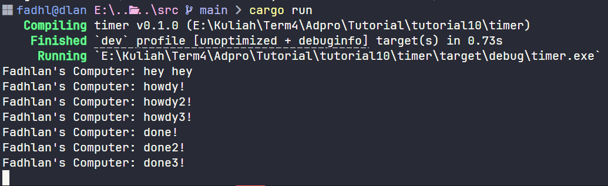

# Async Tutorial Timer

## Reflection

Experiment 1.2: Understanding how it works

After adding a print statement right after `spawner.spawn` in `main.rs`, I ran the program. The print statement after `spawner.spawn` appeared first in the terminal, even though it was written below the code inside `spawner.spawn`. This happens because the print after `spawner.spawn` is outside the async block, so it runs immediately and synchronously. In contrast, the code inside the async block is not executed right away; instead, it is scheduled as a task to be run later by the executor. Only after that, `executor.run()` starts processing the async tasks that were sent by `spawner.spawn`. That’s why the prints inside the async block (like "hey hey" and "howdy!") appear after, and there is a delay before "done!" is printed. This demonstrates how Rust's async runtime separates task scheduling from execution.

Experiment 1.3: Multiple Spawn and removing drop

In this experiment, I added three tasks using `spawner.spawn`. Each task prints a message ("howdy!", "howdy2!", "howdy3!"), waits for 2 seconds, and then prints "done!", "done2!", and "done3!" respectively. The output appears in order: howdy, howdy2, howdy3, then after 2 seconds, done, done2, done3.

However, after all the tasks finish, the program does not exit and keeps running. This is because I removed the `drop(spawner)` statement. The `drop(spawner)` is important because it tells the executor that no more tasks will be added. Without it, the executor keeps waiting for new tasks, so the program hangs after finishing all current tasks. When we use `drop(spawner)`, the executor knows there will be no more tasks, exits the loop, and the program ends normally.

