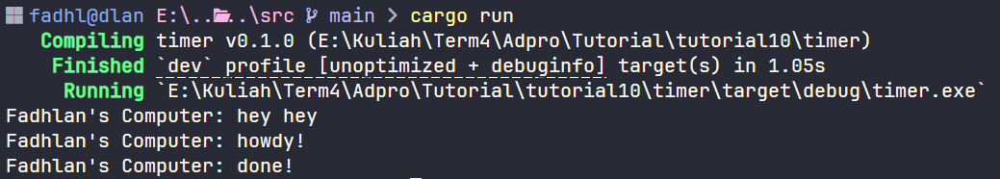

# Async Tutorial Timer

## Reflection

Experiment 1.2: Understanding how it works

After adding a print statement right after `spawner.spawn` in `main.rs`, I ran the program. The print statement after `spawner.spawn` appeared first in the terminal, even though it was written below the code inside `spawner.spawn`. This happens because the print after `spawner.spawn` is outside the async block, so it runs immediately and synchronously. In contrast, the code inside the async block is not executed right away; instead, it is scheduled as a task to be run later by the executor. Only after that, `executor.run()` starts processing the async tasks that were sent by `spawner.spawn`. That’s why the prints inside the async block (like "hey hey" and "howdy!") appear after, and there is a delay before "done!" is printed. This demonstrates how Rust's async runtime separates task scheduling from execution.

